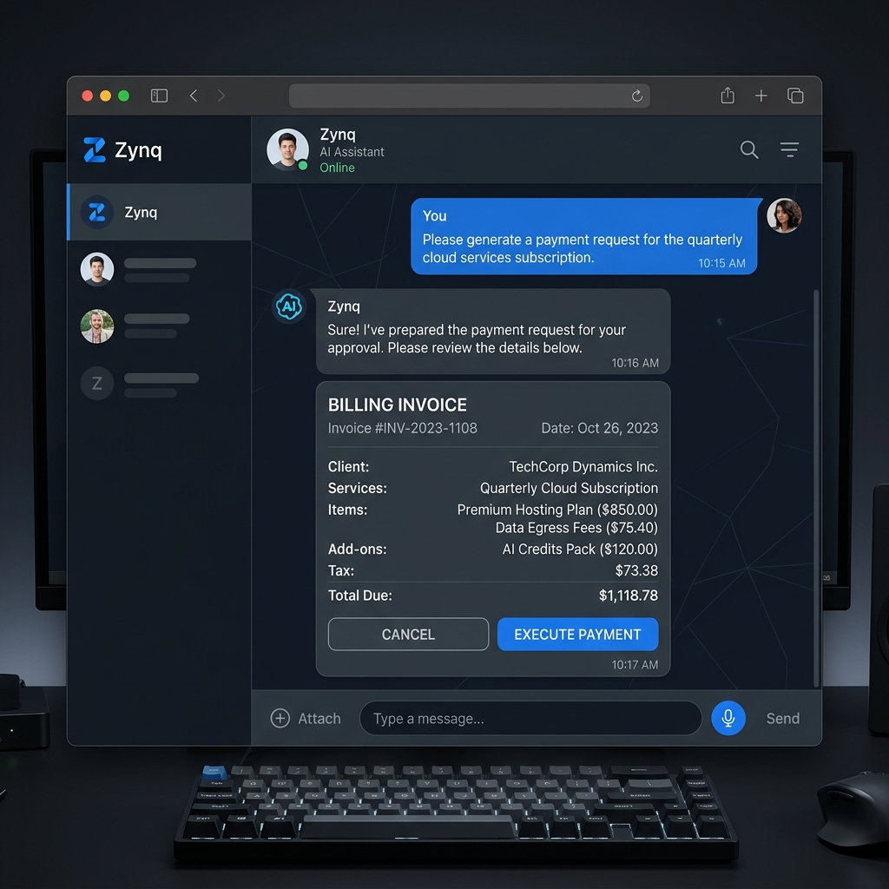

# Zynq

Zynq is a comprehensive, AI-powered shop management and Point of Sale (POS) system designed specifically for small businesses in Pakistan. It simplifies inventory management, billing, and Udhaar (credit) tracking through an intuitive interface and voice-activated AI agents.

## ✨ Features

- **Voice-Activated Agent**: A WhatsApp-style interface where shop owners can manage their store via Urdu voice notes.
- **Inventory Management**: Track products, stock levels, and expiry dates.
- **Udhaar (Credit) System**: Manage pending payments and send polite WhatsApp reminders to customers.
- **Smart Analytics**: Real-time dashboard showing daily revenue, low stock alerts, and top-selling products.
- **Offline Mode (PWA)**: Keep working even when the internet drops. Actions sync automatically when connection restores.
- **Automated WhatsApp Receipts**: Instantly send digital itemized bills to customers via WhatsApp.
- **Cron Jobs**: Daily expiry warnings and weekly sales reports sent directly to the shop owner's WhatsApp.

## 🖼️ Previews

### Dashboard & Analytics
A sleek, premium SaaS dashboard with dark mode glassmorphism aesthetics.


### AI Agent Chat Interface
Manage your shop naturally. Just tap the mic and say "Add 5 packets of Lays to inventory".


## 🛠️ Technology Stack

**Frontend:**
- Next.js (App Router)
- Tailwind CSS
- Zustand (State Management)
- React Query
- next-pwa (Offline capabilities)

**Backend:**
- Node.js & Express
- PostgreSQL (via Drizzle ORM)
- Redis (Caching)
- OpenAI API (Whisper & Function Calling)
- Meta WhatsApp Cloud API

**Infrastructure:**
- Docker & Docker Compose
- GitHub Actions CI/CD
- Railway Deployment

## 🚀 Getting Started

### Prerequisites
- Node.js (v20+)
- PostgreSQL
- Redis
- OpenAI API Key
- Meta WhatsApp Business API Token

### Setup
1. Clone the repository:
   ```bash
   git clone https://github.com/akramlatif/Zynq.git
   ```
2. Install dependencies for the server, client, and shared packages:
   ```bash
   npm install
   ```
3. Copy environment files and add your keys:
   ```bash
   cp server/.env.example server/.env
   cp client/.env.example client/.env.local
   ```
4. Start the database and Redis using Docker:
   ```bash
   docker-compose up -d postgres redis
   ```
5. Run migrations:
   ```bash
   cd server && npm run db:migrate
   ```
6. Start the development servers:
   ```bash
   # From the root directory
   npm run dev
   ```

## 🔒 Security
- Rate limiting implemented (100 req/15 min globally, strict limits on Auth).
- Advanced HTTP Parameter Pollution protection and strict CSP.
- Custom middleware for SQL injection defense-in-depth.

## 📄 License
This project is proprietary software built for the Pakistan market.
